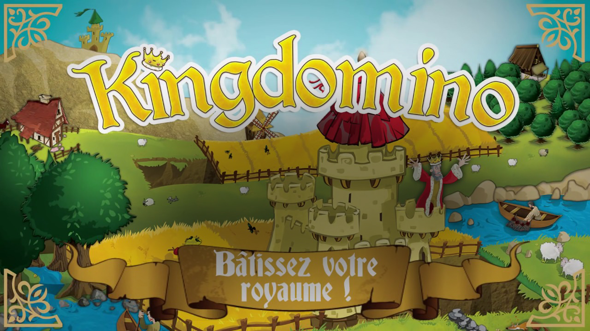

# KingDomino
PC version of board game 'KingDomino', AI players included.

## Introduction
Domi'Nations is a fun board game.
The goal of this project is to reprogram the game on the computer with JAVA in order to allow
players to play it more practically.
We have also built an AI capable of playing by the rules to allow
players to play on their own.

## Presentation of the board game Domi’Nations

A Domi’Nations game allows 2 to 4 players to participate. Each player using
dominoes to build his kingdom of size 5x5.
The game material is made up of:
* 4 starting tiles
* 4 castles to put on the starting tiles (pink, yellow, green, blue)
* 48 dominoes (with one landscape side, one numbered side)
* 8 wooden kings (2 of each color)

These dominoes each have two portions of land, some portions have a certain
crown number.
A certain number of dominoes are used depending on the number of player each player has
one or two kings, during each turn the players choose dominoes and place them in
their land. When all the dominoes have been placed, the player with the highest score wins.
The more detailed process will be developed in the following parts.

## User manual
* Import the project, if there are slick errors, re-import slick2D.
* Run the Main class, the game begins. Type enter to begin.
* To have an AI, enter “AI” as the player name.
* For each turn, choose a domino by clicking on the domino, place the domino
in the field by clicking in the place you want. You must type enter at the end of
every turn.
* To turn the domino, tap on the left and right of the keyboard or use the
right of your mouse.
